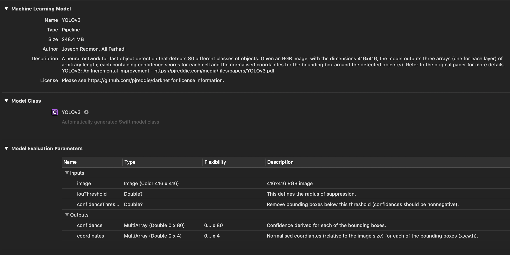
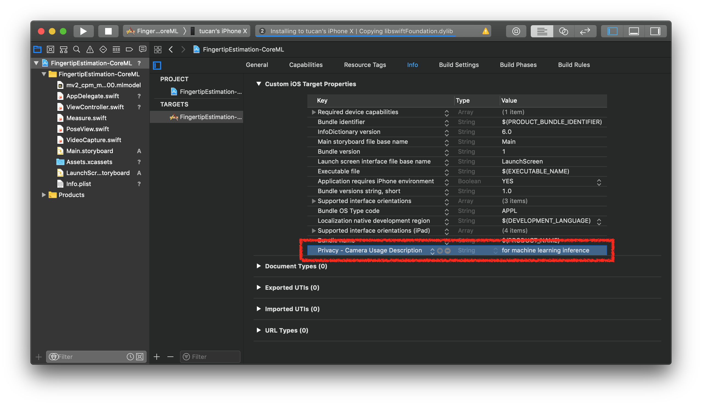

# ObjectDetection-CoreML


This project is Object Detection on iOS with Core ML.<br>If you are interested in iOS + Machine Learning, visit [here](https://github.com/motlabs/iOS-Proejcts-with-ML-Models) you can see various DEMOs.<br>

## How it works

(preparing...)

## Requirements

- Xcode 10.3+
- iOS 12.0+
- Swift 4.2

## Model

### Model Matadata



### Model Size, Minimum iOS Version, Download Link

| Model | Size<br>(MB) | Minimum<br>iOS Version | Download Link |
| ----: | :----: | :----: | ----|
| YOLOv3 | 248.4 | iOS12 | [Machine Learning - Models - Apple Developer](https://developer.apple.com/machine-learning/models) |
| YOLOv3FP16 | 124.2 | iOS12 | [Machine Learning - Models - Apple Developer](https://developer.apple.com/machine-learning/models) |
| YOLOv3Int8LUT | 62.2 | iOS12 | [Machine Learning - Models - Apple Developer](https://developer.apple.com/machine-learning/models) |
| YOLOv3Tiny | 35.5 | iOS12 | [Machine Learning - Models - Apple Developer](https://developer.apple.com/machine-learning/models) |
| YOLOv3TinyFP16 | 17.8 | iOS12 | [Machine Learning - Models - Apple Developer](https://developer.apple.com/machine-learning/models) |
| YOLOv3TinyInt8LUT | 8.9 | iOS12 | [Machine Learning - Models - Apple Developer](https://developer.apple.com/machine-learning/models) |
| MobileNetV2_SSDLite | 9.3 | iOS12 | [SSDMobileNet - Core ML Survival Guide](https://github.com/hollance/coreml-survival-guide/blob/master/MobileNetV2%2BSSDLite/ObjectDetection) |
| ObjectDetector | 63.7 | iOS12 | [Recognizing Objects in Live Capture \| Apple Developer Documentation](https://developer.apple.com/documentation/vision/recognizing_objects_in_live_capture) |

### Infernece Time (ms)

| Model vs. Device | 11<br>Pro | XS | XS<br>Max | XR | X | 7+ | 7 |
| ----: | :----: | :----: | :----: | :----: | :----: | :----: | :----: | 
| YOLOv3 | 83 | 108 | 93 | 100 | 356 | 569 | 561 | 
| YOLOv3FP16 | 84 | 104 | 89 | 101 | 348 | 572 | 565 | 
| YOLOv3Int8LUT | 86 | 101 | 92 | 100 | 337 | 575 | 572 | 
| YOLOv3Tiny | 44 | 46 | 41 | 47 | 106 | 165 | 168 | 
| YOLOv3TinyFP16 | 44 | 51 | 41 | 44 | 103 | 165 | 167 | 
| YOLOv3TinyInt8LUT | 44 | 45 | 39 | 39 | 106 | 160 | 161 | 
| MobileNetV2_SSDLite | 18 | 31 | 31 | 31 | 109 | 141 | 134 | 
| ObjectDetector | 18 | 24 | 26 | 23 | 63 | 86 | 84 | 

### Total Time (ms)

| Model vs. Device | 11<br>Pro | XS | XS<br>Max | XR | X | 7+ | 7 |
| ----: | :----: | :----: | :----: | :----: | :----: | :----: | :----: | 
| YOLOv3 | 84 | 108 | 93 | 100 | 357 | 569 | 561 | 
| YOLOv3FP16 | 85 | 104 | 89 | 101 | 348 | 572 | 565 | 
| YOLOv3Int8LUT | 86 | 102 | 92 | 102 | 338 | 576 | 573 | 
| YOLOv3Tiny | 45 | 46 | 42 | 48 | 106 | 166 | 169 | 
| YOLOv3TinyFP16 | 45 | 51 | 41 | 44 | 104 | 165 | 167 | 
| YOLOv3TinyInt8LUT | 45 | 45 | 39 | 40 | 107 | 160 | 161 | 
| MobileNetV2_SSDLite | 19 | 32 | 31 | 32 | 109 | 142 | 134 | 
| ObjectDetector | 18 | 25 | 26 | 23 | 64 | 87 | 85 | 

### FPS

| Model vs. Device | 11<br>Pro | XS | XS<br>Max | XR | X | 7+ | 7 |
| ----: | :----: | :----: | :----: | :----: | :----: | :----: | :----: | 
| YOLOv3 | 9 | 8 | 10 | 9 | 2 | 1 | 1 | 
| YOLOv3FP16 | 9 | 9 | 10 | 8 | 2 | 1 | 1 | 
| YOLOv3Int8LUT | 9 | 9 | 10 | 9 | 2 | 1 | 1 | 
| YOLOv3Tiny | 14 | 21 | 22 | 20 | 8 | 5 | 5 | 
| YOLOv3TinyFP16 | 14 | 19 | 23 | 21 | 9 | 5 | 5 | 
| YOLOv3TinyInt8LUT | 14 | 21 | 24 | 23 | 8 | 5 | 5 | 
| MobileNetV2_SSDLite | 29 | 23 | 23 | 23 | 8 | 6 | 6 | 
| ObjectDetector | 29 | 23 | 23 | 24 | 14 | 10 | 11 | 

### Get your own model

> Or you can use your own object detection model

## Build & Run

### 1. Prerequisites

#### 1.1 Import object detection model


Once you import the model, compiler generates model helper class on build path automatically. You can access the model through model helper class by creating an instance, not through build path.

#### 1.2 Add permission in info.plist for device's camera access



### 2. Dependencies

No external library yet.

### 3. Code

#### 3.1 Import Vision framework

```swift
import Vision
```

#### 3.2 Define properties for Core ML

```swift
class ViewController: UIViewController {
    //
    // ...
    //

    // MARK: - Vision Properties
    var request: VNCoreMLRequest?
    var visionModel: VNCoreMLModel?

    //
    // ...
    //
}

```

#### 3.3 Configure and prepare the model

```swift
// MARK: - Setup Core ML
extension ViewController {
    func setupModel() {
        if let visionModel = try? VNCoreMLModel(for: objectDectectionModel.model) {
            self.visionModel = visionModel
            request = VNCoreMLRequest(model: visionModel, completionHandler: visionRequestDidComplete)
            request?.imageCropAndScaleOption = .scaleFill
        } else {
            fatalError("fail to create vision model")
        }
    }
}
```

```swift
// MARK: - Post-processing
extension ViewController {
    func visionRequestDidComplete(request: VNRequest, error: Error?) {
        if let predictions = request.results as? [VNRecognizedObjectObservation] {
            // <# TODO #>
        }
    }
}
```

#### 3.4 Inference 🏃‍♂️

```swift
// MARK: - Inference!
extension ViewController {
    func predictUsingVision(pixelBuffer: CVPixelBuffer) {
        let handler = VNImageRequestHandler(cvPixelBuffer: pixelBuffer)
        try? handler.perform([request])
    }
}
```

## Performance Test

(preparing...)


## See also

- [motlabs/awesome-ml-demos-with-ios](https://github.com/motlabs/awesome-ml-demos-with-ios)<br>
  : The challenge using machine learning model created from tensorflow on iOS
- [Machine Learning - Models - Apple Developer](https://developer.apple.com/machine-learning/models)
- [hollance/coreml-survival-guide](https://github.com/hollance/coreml-survival-guide)
- [vonholst/SSDMobileNet_CoreML](https://github.com/vonholst/SSDMobileNet_CoreML)<br>
  : iOS project for object detection(SSDMobileNet V1) using Core ML.
